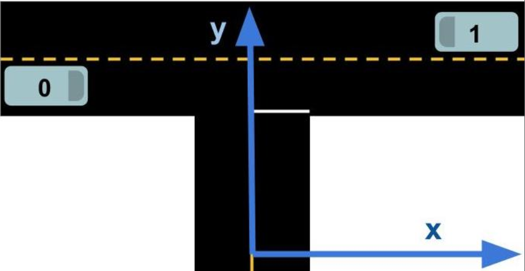

# Inputs and Outputs to Prediction

 
  
 
 

A prediction module uses a map and data from sensor fusion to generate predictions for what all other dynamic objects in view are likely to do. To make this clearer, let's look at an example (in json format) of what the input to and output from prediction might look like.

## Example Input - Sensor Fusion

        {
            "timestamp" : 34512.21,
            "vehicles" : [
                {
                    "id"  : 0,
                    "x"   : -10.0,
                    "y"   : 8.1,
                    "v_x" : 8.0,
                    "v_y" : 0.0,
                    "sigma_x" : 0.031,
                    "sigma_y" : 0.040,
                    "sigma_v_x" : 0.12,
                    "sigma_v_y" : 0.03,
                },
                {
                    "id"  : 1,
                    "x"   : 10.0,
                    "y"   : 12.1,
                    "v_x" : -8.0,
                    "v_y" : 0.0,
                    "sigma_x" : 0.031,
                    "sigma_y" : 0.040,
                    "sigma_v_x" : 0.12,
                    "sigma_v_y" : 0.03,
                },
            ]
        }
        
        
        
## Example Output

        {
            "timestamp" : 34512.21,
            "vehicles" : [
                {
                    "id" : 0,
                    "length": 3.4,
                    "width" : 1.5,
                    "predictions" : [
                        {
                            "probability" : 0.781,
                            "trajectory"  : [
                                {
                                    "x": -10.0,
                                    "y": 8.1,
                                    "yaw": 0.0,
                                    "timestamp": 34512.71
                                },
                                {
                                    "x": -6.0,
                                    "y": 8.1,
                                    "yaw": 0.0,
                                    "timestamp": 34513.21
                                },
                                {
                                    "x": -2.0,
                                    "y": 8.1,
                                    "yaw": 0.0,
                                    "timestamp": 34513.71
                                },
                                {
                                    "x": 2.0,
                                    "y": 8.1,
                                    "yaw": 0.0,
                                    "timestamp": 34514.21
                                },
                                {
                                    "x": 6.0,
                                    "y": 8.1,
                                    "yaw": 0.0,
                                    "timestamp": 34514.71
                                },
                                {
                                    "x": 10.0,
                                    "y": 8.1,
                                    "yaw": 0.0,
                                    "timestamp": 34515.21
                                },
                            ]
                        },
                        {
                            "probability" : 0.219,
                            "trajectory"  : [
                                {
                                    "x": -10.0,
                                    "y": 8.1,
                                    "yaw": 0.0,
                                    "timestamp": 34512.71
                                },
                                {
                                    "x": -7.0,
                                    "y": 7.5,
                                    "yaw": -5.2,
                                    "timestamp": 34513.21
                                },
                                {
                                    "x": -4.0,
                                    "y": 6.1,
                                    "yaw": -32.0,
                                    "timestamp": 34513.71
                                },
                                {
                                    "x": -3.0,
                                    "y": 4.1,
                                    "yaw": -73.2,
                                    "timestamp": 34514.21
                                },
                                {
                                    "x": -2.0,
                                    "y": 1.2,
                                    "yaw": -90.0,
                                    "timestamp": 34514.71
                                },
                                {
                                    "x": -2.0,
                                    "y":-2.8,
                                    "yaw": -90.0,
                                    "timestamp": 34515.21
                                },
                            ]

                        }
                    ]
                },
                {
                    "id" : 1,
                    "length": 3.4,
                    "width" : 1.5,
                    "predictions" : [
                        {
                            "probability" : 1.0,
                            "trajectory" : [
                                {
                                    "x": 10.0,
                                    "y": 12.1,
                                    "yaw": -180.0,
                                    "timestamp": 34512.71
                                },
                                {
                                    "x": 6.0,
                                    "y": 12.1,
                                    "yaw": -180.0,
                                    "timestamp": 34513.21
                                },
                                {
                                    "x": 2.0,
                                    "y": 12.1,
                                    "yaw": -180.0,
                                    "timestamp": 34513.71
                                },
                                {
                                    "x": -2.0,
                                    "y": 12.1,
                                    "yaw": -180.0,
                                    "timestamp": 34514.21
                                },
                                {
                                    "x": -6.0,
                                    "y": 12.1,
                                    "yaw": -180.0,
                                    "timestamp": 34514.71
                                },
                                {
                                    "x": -10.0,
                                    "y": 12.1,
                                    "yaw": -180.0,
                                    "timestamp": 34515.21
                                }
                            ]
                        }
                    ]
                }
            ]
        }

Notes
1. The predicted trajectories shown here only extend out a few seconds. In reality the predictions we make extend to a horizon of 10-20 seconds. 
2. The trajectories shown have 0.5 second resolution. In reality we would generate slightly finer-grained predictions. 
3. This example only shows vehicles but in reality we would also generate predictions for all dynamic objects in view.

