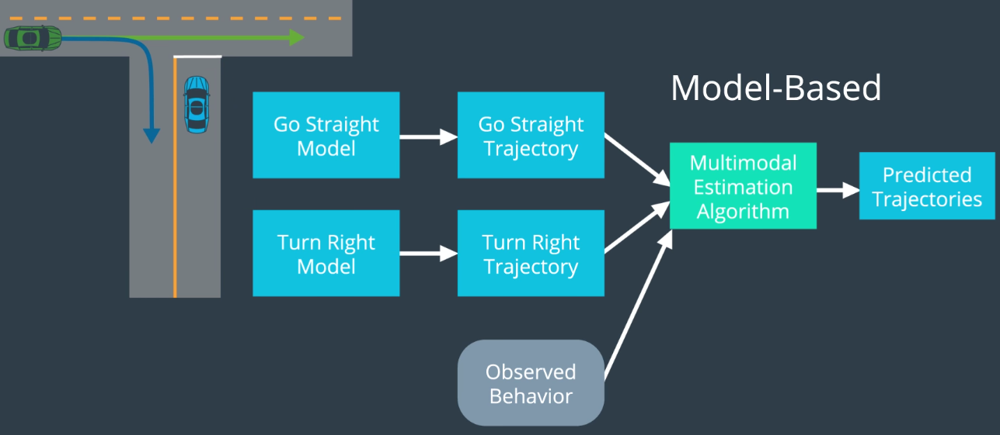

# Prediction Phase in the trajectory generation of cars
 
To understand what the prediction does, imagine at T-shaped intersection. You are a self-driving car that has just pulled up to the stop sign. You want to turn left but your sensors notice another vehicle coming from the left. At this point, you as a human probably know the green vehicle will do one of two things,
* Either it will go straight 
* Or it will go right.

 
  
 
 
Let's say that at this point, the green vehicle starts slowing down and moving right in the lane.Well, you probably know that they are turning right which means it is safe for you to go left. By making a successful prediction, you were able to make a decision that got you to your destination safely and efficiently and what makes prediction interesting but also challenging is that it is inherently multi-modal. 

A good way of thinking about what that means is to think of how you would answer the question "Where is the green car likely to be in five seconds?" If we try to come up with the probability distribution, we would see that it has multiple peaks or moats. If the car is going straight, then the car is likely to be somewhere here (see gif) but if the car turns right, then it's more likely to be here(see gif).
 
 
  
 

In general, the way we think about handling multi-modal uncertainty is by maintaining some beliefs about how probable each potential mode is. Initially, if we just see this green car coming from far away, those beliefs could be initialized using some prior knowledge about this intersection (see gif at time step 0).

In this case, let's say that car generally goes straight at this intersection.But as we continue watching the car we may notice that it is slowing down. Since this behavior is more consistent with turning right, the probability of turning right increases. And then, at the next timestep, we might notice that the car has already started turning right which again increases the probability of turning right.
And as we keep observing, we continue updating our belief based on new evidence until eventually we can predict with high certainty that the vehicle is turning right at this intersection.

 
 
  
 

The responsibility of the prediction module is to do the following: 

* We take as input a map of the world and data from sensor fusion
* As output we generate some predictions of the future state of all the vehicles and other moving objects in the vicinity of our vehicle.

Typically, these predictions are represented by a set of possible trajectories like that two dotted arrows emanating from the green car in this scenario and an associated probability for each trajectory.

 
  
 

**Before we get into the details, let me explain what we are going to discuss in this repository.**

<b>
 
1. First, we'll go through a brief overview where you will learn a bit more about the inputs and outputs to prediction.

2. Next, we will talk about how prediction is actually done.

3. We will discuss the two main classes of prediction techniques:model-based approaches and data-driven approaches. Model-based approaches use mathematical models of motion to predict trajectories and data-driven approaches rely on machine learning and examples to learn from (trajectory clustering will be expalined).

4. Then, we will dig into model-based approaches where I will introduce process models as a mathematical technique for modelling various maneuvers like lane changes, vehicle following, etc and introduce multi-modal estimators as an effective technique for handling the uncertainty associated with prediction, namely, the uncertainty about which maneuver an object will do in a particular situation.

5. Finally, we will dive deep into hybrid approaches which use data and process models to predict motion through a cycle of intense classification where we try to figure out what a driver wants to do and trajectory generation where we try to figure out how they are likely to do it.

6. We will end by implementing an algorithm called Naive Bayes to predict the motion of a car at a T-shaped intersection like the one you just saw.

</b>

## 1.Inputs and Outputs to Prediction

 To see a bit more about the inputs and outputs of prediction, check this [file](https://github.com/A2Amir/Prediction-Phase-in-the-trajectory-generation-of-cars/blob/master/Inputs%20and%20Outputs%20to%20Prediction.md)
 
## 2.Model-Based 
For the example explained above, the way we would handle this with the model based approach is as follows:
* First we would come up with two process models (one for going straight and one for turning right).
* And we would use some simple trajectory generator to figure out what trajectory we would expect to see if the driver were going straight or turning right.
* Then we would pay attention to the actual behavior of the target vehicle and using a multimodal estimation algorithm. we would compare observed trajectory to the ones we would expect for each of our models and then based on that we would assign a probability to each of the possible trajectories.

 
  
 

The important takeaway for purely model based prediction is that we have some bank of possible behaviors and each has a mathematical model of motion which takes into account the physical capabilities of the object as well as the constraints imposed by the road traffic laws and other restrictions.

## 3. Data driven approach

Well with the purely data driven approach we have a truly blackbox algorithm and this algorithm will be trained on lots of training data. Once it's trained we just fitted the observed behavior and let it make a prediction about what will happen next.

  ### 1. Data Driven Example - Trajectory Clustering

There are many ways that machine learning algorithms can be used in purely data driven approaches for prediction. Since you already know machine-learning algorithms, we won't go into these techniques in too much detail.
With all data driven prediction techniques, there will be two phases:

1.	An offline training phase where the algorithm learns a model from data
2.	Online prediction phase where it uses that model to generate predictions.

#### Offline training phase
* The first step of an offline training phase is to get a lot of data which you might do by placing a static camera at an intersection.
* Then, we have to clean the data since some of the cars we observe may be occluded or something else went wrong in the processing step.So we need to discard the bad data.
* Once the data is gathered and cleaned up,we would be left with a bunch of trajectories that look something like below.

 
  
 

* Next, we need to define some mathematical measure of trajectory similarity and there are many ways to do this but intuitively we want something that says a trajectory like the red line is more similar to the pink  line than it is to the blue line. If you're interested in learning more,check this [paper](http://video.udacity-data.com.s3.amazonaws.com/topher/2017/July/5978c2c6_trajectory-clustering/trajectory-clustering.pdf) that discuss measures of similarity in detail.

* Once we have a measure of similarity we can use a machine learning algorithm like agglomerative clustering or a spectral clustering to clustered these trajectories. In the case of a four-way stop intersection,we would expect to see 12 clusters since at each of the four stop signs cars can do one of three things: turn right,go straight, turn left. If we were looking at just one of those four stop signs, we would expect to see a cluster of trajectories for left turns, going straight, and turning right.

 
  
 

**Note that in some situations you may obtain even more clusters than that.For example, if this lane is controlled by a traffic light instead of stop,your clustering algorithm will probably create twice as many clusters. Three of them go through the intersection without stopping and three of them stop at the traffic light first.**

* Once the trajectories have been grouped in too clusters, it is useful to define what prototype trajectories look like for each cluster. For the left turn cluster, maybe these three trajectories are a good model.They provide a compact representation of what left turns typically look like at this intersection.

 
  
 
 
 At this point, we have a trained model of typical car behavior at this intersection.The next step is to use this model on the road to actually generate predictions.

## Pros and Cons:

Model based approaches incorporate our knowledge of physics constraints imposed by the road traffic and  data driven approaches are nice because they let us use data to extract subtle patterns that would otherwise be missed by model based approaches.For example differences in vehicle behavior at an intersection during different times.

