# Prediction Phase in the trajectory generation of cars

## 1.Introduction to Prediction

To understand what the prediction does, imagine at T-shaped intersection. You are a self-driving car that has just pulled up to the stop sign. You want to turn left but your sensors notice another vehicle coming from the left. At this point, you as a human probably know the green vehicle will do one of two things,
* Either it will go straight 
* Or it will go right.

 
 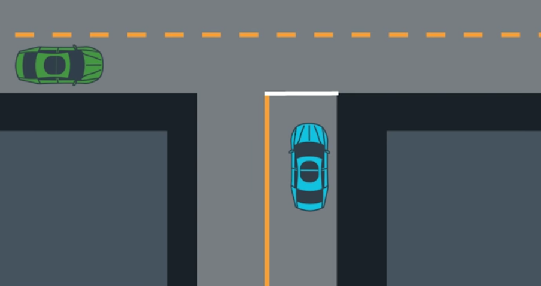 
 
 
Let's say that at this point, the green vehicle starts slowing down and moving right in the lane.Well, you probably know that they are turning right which means it is safe for you to go left. By making a successful prediction, you were able to make a decision that got you to your destination safely and efficiently and what makes prediction interesting but also challenging is that it is inherently multi-modal. 

A good way of thinking about what that means is to think of how you would answer the question "Where is the green car likely to be in five seconds?" If we try to come up with the probability distribution, we would see that it has multiple peaks or moats. If the car is going straight, then the car is likely to be somewhere here (see gif) but if the car turns right, then it's more likely to be here(see gif).
 
 
 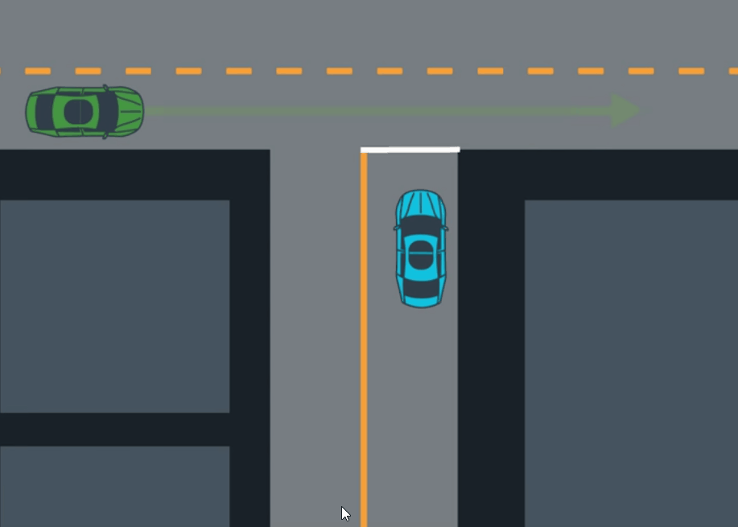 
 

In general, the way we think about handling multi-modal uncertainty is by maintaining some beliefs about how probable each potential mode is. Initially, if we just see this green car coming from far away, those beliefs could be initialized using some prior knowledge about this intersection (see gif at time step 0).

In this case, let's say that car generally goes straight at this intersection.But as we continue watching the car we may notice that it is slowing down. Since this behavior is more consistent with turning right, the probability of turning right increases. And then, at the next timestep, we might notice that the car has already started turning right which again increases the probability of turning right.
And as we keep observing, we continue updating our belief based on new evidence until eventually we can predict with high certainty that the vehicle is turning right at this intersection.

 
 
 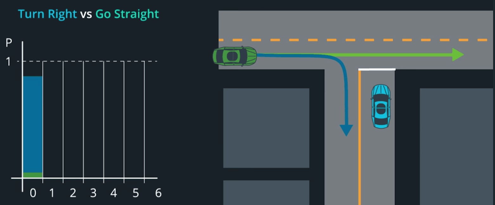 
 

The responsibility of the prediction module is to do the following: 

* We take as input a map of the world and data from sensor fusion
* As output we generate some predictions of the future state of all the vehicles and other moving objects in the vicinity of our vehicle.

Typically, these predictions are represented by a set of possible trajectories like that two dotted arrows emanating from the green car in this scenario and an associated probability for each trajectory.

 
 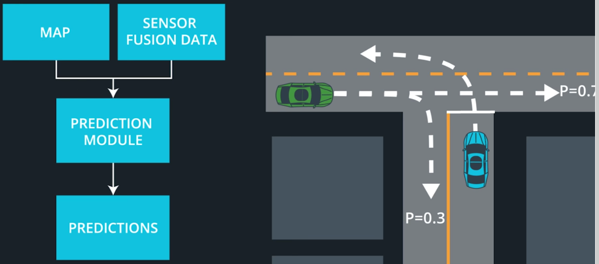 
 

**Before we get into the details, let me explain what we are going to discuss in this repository.**

<b>
 
1. First, we'll go through a brief overview where you will learn a bit more about the inputs and outputs to prediction.

2. Next, we will talk about how prediction is actually done.

3. We will discuss the two main classes of prediction techniques:model-based approaches and data-driven approaches. Model-based approaches use mathematical models of motion to predict trajectories and data-driven approaches rely on machine learning and examples to learn from (trajectory clustering will be expalined).

4. Then, we will dig into model-based approaches where I will introduce process models as a mathematical technique for modelling various maneuvers like lane changes, vehicle following, etc and introduce multi-modal estimators as an effective technique for handling the uncertainty associated with prediction, namely, the uncertainty about which maneuver an object will do in a particular situation.

5. Finally, we will dive deep into hybrid approaches which use data and process models to predict motion through a cycle of intense classification where we try to figure out what a driver wants to do and trajectory generation where we try to figure out how they are likely to do it.

6. We will end by implementing an algorithm called Naive Bayes to predict the motion of a car at a T-shaped intersection like the one you just saw.

</b>

## 2.Inputs and Outputs to Prediction

 To see a bit more about the inputs and outputs of prediction, check this [file](https://github.com/A2Amir/Prediction-Phase-in-the-trajectory-generation-of-cars/blob/master/Inputs%20and%20Outputs%20to%20Prediction.md)
 
## 3.Model-Based 

Ideally, we would also like to include, in our predictions,all the insights we have about driver behavior, physics, or vehicle dynamics. This is where model based approaches can help.
The way these approaches typically work is as follows:

#### 1.	For each object identify all the behaviours that object is likely to do in the current situation. The behaviour for a vehicle could be something like change lanes, turn left and for a pedestrian, it could be cross the street on pedestrian crossing. For our intersection scenario, the behaviours could be go straight, turn left, turn right (Whatever it is, it needs to be something that we can describe mathematically).

#### 2.	Step two, define a process model for each behavior. A process model is a mathematical description of object motion for behavior. It is a function, which can be used to compute the state of the object at time t+1 from the state at time t. The process model must incorporate some uncertainty, which represents how much we trust our model. How do we describe each behavior mathematically? We have many options here.

  In general, there is a tradeoff between simplicity and accuracy when choosing a process model:

* One very simple approach is to treat the car as a point particle with holonomic properties. This means we assume the point can move in any direction at any time. Which of course is a very simplistic assumption. 

* The simplest motion models are linear. Constant velocity lane following for any coordinates would look something like below. Where the car moves forward at each timestep and is assumed to keep a constant distance to the lane center. In practice, linear point models usually wind up being too simplistic. 

 
 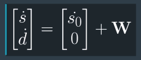 
 
 
* The next step in complexity happens when we allow non-linearities into our model. Typically, if you start incorporating heading into our state vector, you will end up with sines and cosines in our model equations. 

   An example of a non-linear point model of lane following could look like below in Cartesian coordinates. Note the presence of cosine and sine, which are where the non-linearity comes in. 

 
 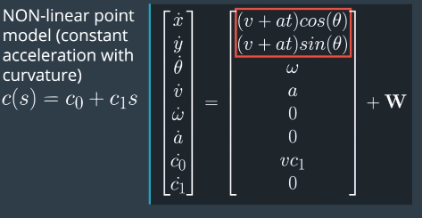 
 

* The next jump in complexity happens when we take into account that a car is a non-holonomic system. A popular approach is to use a bicycle model, which looks like this in an inertial cartesian reference frame. A bicycle model takes two inputs, the steering angle and the acceleration. 

 
 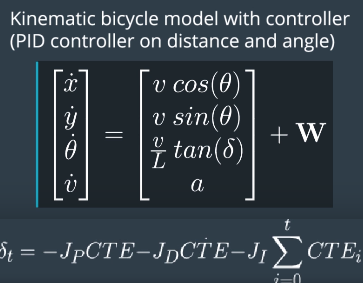 
 

   For the steering angle, we could use a PID controller with the target lane center line as the reference line. For the acceleration, we could once again use a constant velocity model, or a constant acceleration model, or if we wanted more complex acceleration behavior, we could use a PID controller with the speed limit as the target. 

   In practice, these sorts of models tend to strike a good balance between simplicity and accuracy. But you could always go more complex by including more details about vehicle dynamics. 

* you could use a dynamic bicycle model, which looks like below.Note the presence of terms like F c, f  which represents the lateral force on the tires at the front of the vehicle, and Fc, r   which represents the lateral force on the rear tire. 

 
 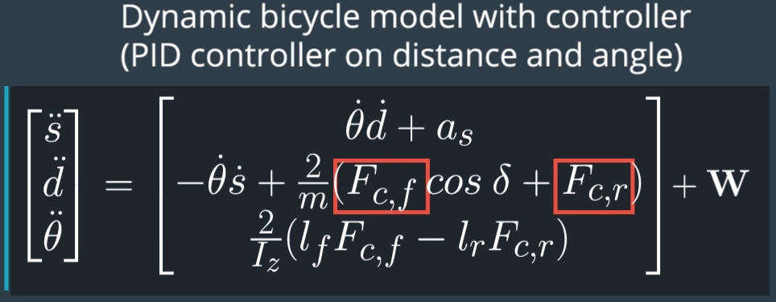 
 

 
<b> 
Notice: how all the models contain an additional term W. This is where the uncertainty on the process model is stored. A classic choice to represent uncertainty is a multivariate Gaussian with zero mean. 

Notice: There is so much uncertainty inherent to predicting the behaviors of other drivers that minor accuracy improvements to process models just aren't worth the computational overhead that they come with. 

</b>

### 3.	step three, which is to use the process models to compute the probability of each behavior. 

  1. This is done by taking the observed state of the object at time t-1, running the process models to compute the expected state of the object at time t. Then we compare the observed state of the object at time t with what our process models predicted. 

   For example,below on the left we see two images of a car. At time k−1 we predicted where the car would be if it were to go straight vs go right. Then at time k we look at where the car actually is. The graph on the right shows the car's observed s coordinate along with the probability distributions for where we expected the car to be at that time. In this case, the s that we observe is substantially more consistent with turning right than going straight.

 
 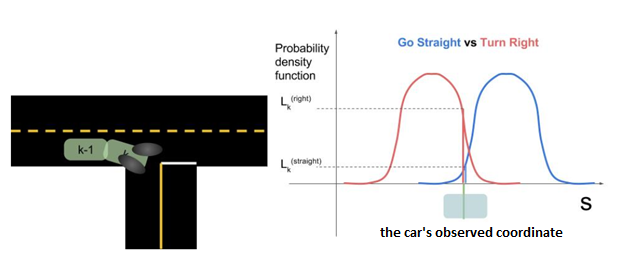 
 

 2. And we use a multimodal estimation algorithm to derive the probability of each maneuver.

    In the image below you can see a bar chart representing probabilities of various clusters over time. Multiple model algorithms serve a similar purpose for model based approaches: they are responsible for maintaining beliefs for the probability of each maneuver. The algorithm we discussed is called the Autonomous Multiple Model algorithm (AMM). AMM can be summarized with this equation:
    
     
 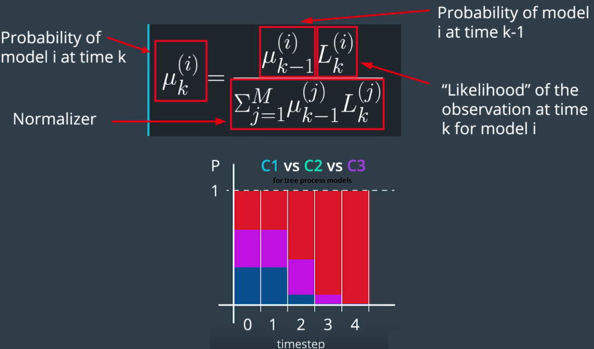 
 

   The paper, "[A comparative study of multiple model algorithms for maneuvering target tracking](https://d17h27t6h515a5.cloudfront.net/topher/2017/June/5953fc34_a-comparative-study-of-multiple-model-algorithms-for-maneuvering-target-tracking/a-comparative-study-of-multiple-model-algorithms-for-maneuvering-target-tracking.pdf)" is a good reference to learn more.

#### 4.	The fourth and final step is to predict a trajectory for each behavior. Trajectory generation is straightforward once we have a process model. We simply iterate our model over and over until we've generated a prediction that spans whatever time horizon we are supposed to cover. Note that each iteration of the process model will necessarily add uncertainty to our prediction.

## 4. Data driven approach

Well with the purely data driven approach we have a truly blackbox algorithm and this algorithm will be trained on lots of training data. Once it's trained we just fitted the observed behavior and let it make a prediction about what will happen next.

 
  
 

  ### 3.1. Data Driven Example - Trajectory Clustering

There are many ways that machine learning algorithms can be used in purely data driven approaches for prediction. Since you already know machine-learning algorithms, we won't go into these techniques in too much detail.
With all data driven prediction techniques, there will be two phases:

1.	An offline training phase where the algorithm learns a model from data
2.	Online prediction phase where it uses that model to generate predictions.

#### Offline training phase:

* The first step of an offline training phase is to get a lot of data which you might do by placing a static camera at an intersection.
* Then, we have to clean the data since some of the cars we observe may be occluded or something else went wrong in the processing step.So we need to discard the bad data.
* Once the data is gathered and cleaned up,we would be left with a bunch of trajectories that look something like below.

 
 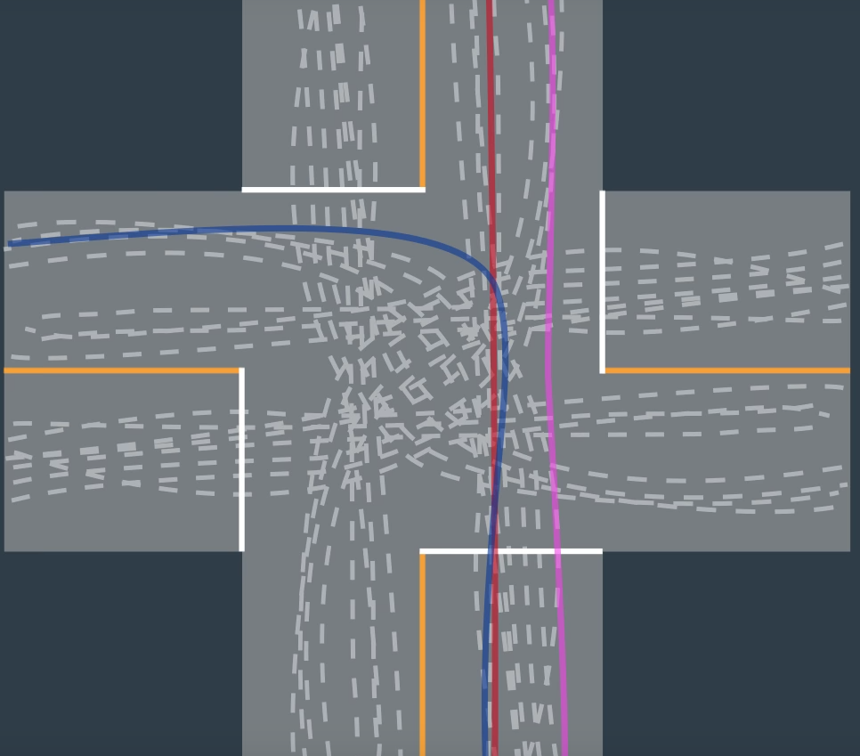 
 

* Next, we need to define some mathematical measure of trajectory similarity and there are many ways to do this but intuitively we want something that says a trajectory like the red line is more similar to the pink  line than it is to the blue line. If you're interested in learning more,check this [paper](http://video.udacity-data.com.s3.amazonaws.com/topher/2017/July/5978c2c6_trajectory-clustering/trajectory-clustering.pdf) that discuss measures of similarity in detail.

* Once we have a measure of similarity we can use a machine learning algorithm like agglomerative clustering or a spectral clustering to clustered these trajectories. In the case of a four-way stop intersection,we would expect to see 12 clusters since at each of the four stop signs cars can do one of three things: turn right,go straight, turn left. If we were looking at just one of those four stop signs, we would expect to see a cluster of trajectories for left turns, going straight, and turning right.

 
 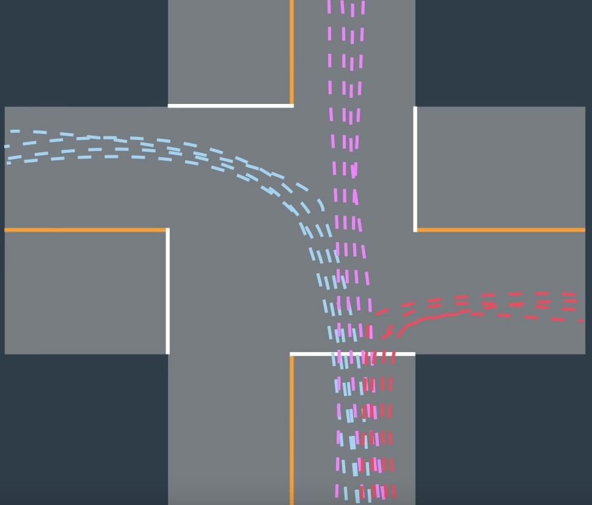 

 
 **Note that in some situations you may obtain even more clusters than that.For example, if this lane is controlled by a traffic light instead of stop,your clustering algorithm will probably create twice as many clusters. Three of them go through the intersection without stopping and three of them stop at the traffic light first.**

* Once the trajectories have been grouped in too clusters, it is useful to define what prototype trajectories look like for each cluster. For the left turn cluster, maybe these three trajectories are a good model.They provide a compact representation of what left turns typically look like at this intersection.

 
 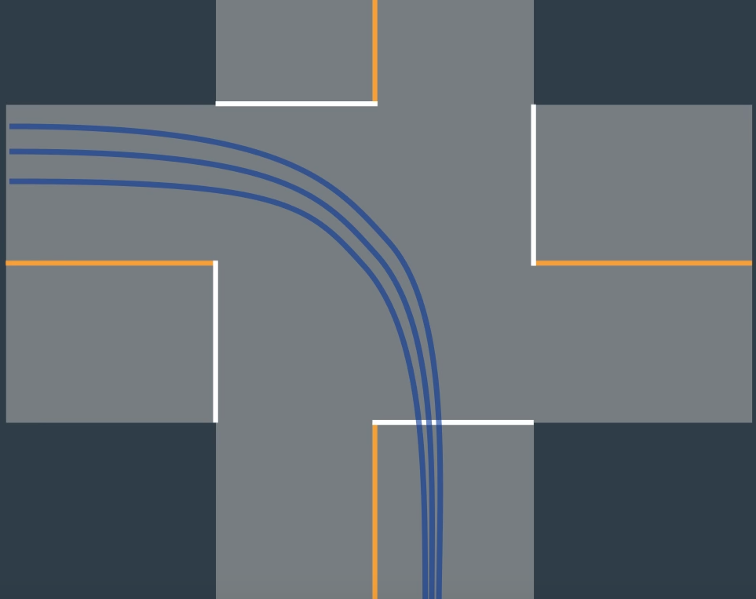 
 
 
   At this point, we have a trained model of typical car behavior at this intersection.The next step is to use this model on the road to actually generate predictions.

#### Online prediction phase:

Once our clustering algorithm has identified clusters and prototype trajectories,in this case three clusters with three prototype trajectories each,we can begin the job of online prediction for a vehicle that we meet on the road.

 
 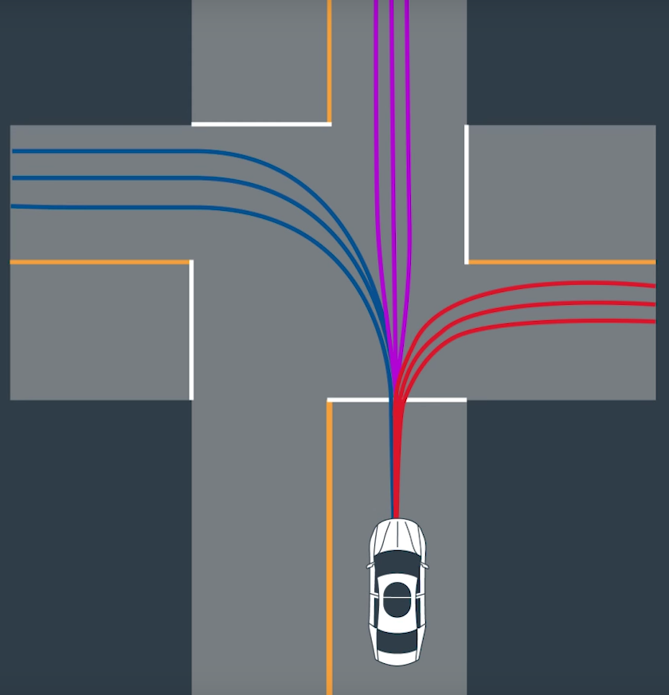 
 

* First, we observed the vehicle's partial trajectory.
* Next we compare it to the corresponding segments of the prototype trajectories for each cluster.This comparison is done using the same similarity measure we used earlier to perform the clustering.The belief for each cluster is updated based on how similar the partial trajectory is to the prototype trajectories.
* And finally, we compute a predicted trajectory for each cluster.For example, by taking the most similar prototype trajectory.

  Let's make this more clear by following the gif below:

 
 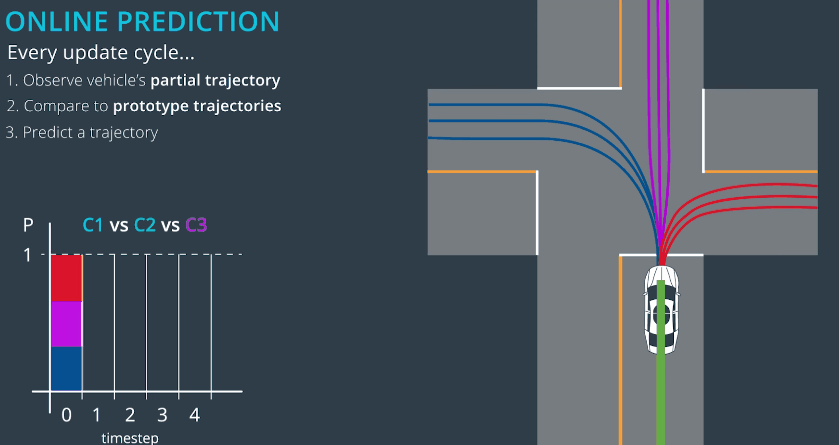 
 

## 5. Hybrid Approaches:

Model based approaches incorporate our knowledge of physics constraints imposed by the road traffic and  data driven approaches are nice because they let us use data to extract subtle patterns that would otherwise be missed by model based approaches.For example differences in vehicle behavior at an intersection during different times.

In practice, the best way to do prediction is often by taking a hybrid approach that takes advantage of the strengths of both types of approaches. Remember earlier when we talked about how model based approaches combine process models with a multimodal estimator? Well, the multimodal estimator could be replaced with a machine learning approach. To replace that component with a machine learning approach, the type of algorithm we need is a Naive Bayes classifier.

 
 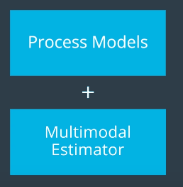 
 

When Naive Bayes goes in distribution for the feature variables then called Gaussian Naive Bayes.

In practice, implementing a good Gaussian Naive Bayes classifier is all about:
* One, selecting the correct feature variables for the classification problem.
* Two identifying some good means and variances for different classes.And we can either guess these numbers or we can look at lots of data to learn them(if you have access to lots of data).

## 6. Frenet Coordinates

"Frenet Coordinates" are a way of representing position on a road in a more intuitive way than traditional (x,y) Cartesian Coordinates.

With Frenet coordinates, we use the variables s and d to describe a vehicle's position on the road. The s coordinate represents distance along the road (also known as longitudinal displacement) and the d coordinate represents side-to-side position on the road (also known as lateral displacement).

 
 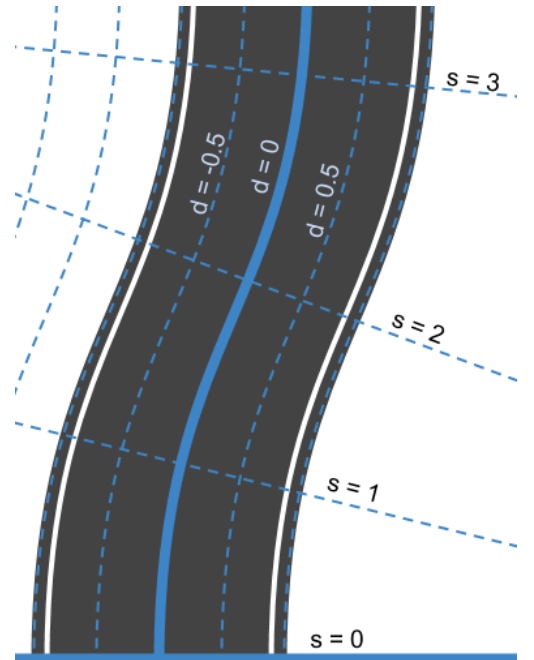 
 

At the bottom we have s=0 to represent the beginning of the segment of road we are thinking about and d=0 to represent the center line of that road. To the left of the center line we have negative d and to the right d is positive.
So what does a typical trajectory look like when presented in Frenet coordinates?

 
 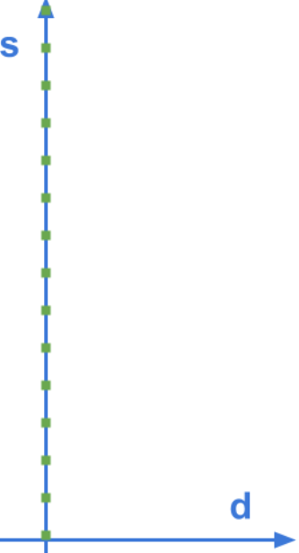 
 

It looks straight! In fact, if this vehicle were moving at a constant speed of v0 we could write a mathematical description of the vehicle's position as:

s(t)=v0t

d(t)=0

## 7. Implement Naive Bayes [C++](https://github.com/A2Amir/Prediction-Phase-in-the-trajectory-generation-of-cars/blob/master/C%2B%2B/main.cpp) and [Python](https://github.com/A2Amir/Prediction-Phase-in-the-trajectory-generation-of-cars/blob/master/GaussianNavieBaysian.ipynb)

A Gaussian Naive Bayes classifier can predict the behavior of vehicles on a highway. In the image below you can see the behaviors you'll be looking for on a 3 lane highway (with lanes of 4 meter width). The dots represent the d (y axis) and s (x axis) coordinates of vehicles as they either...

1.	change lanes left (shown in blue)
2.	keep lane (shown in black)
3.	or change lanes right (shown in red)

 
 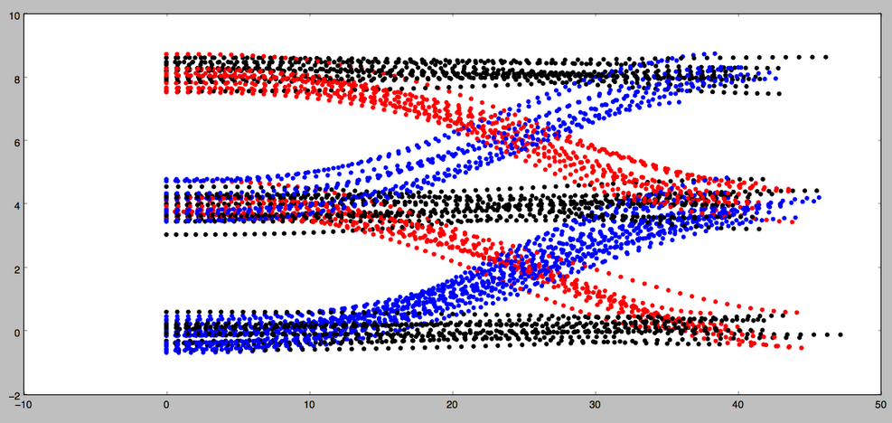 
 

A Naive Bayes classifier that can predict which of these three maneuvers a vehicle is engaged in given a single coordinate (sampled from the trajectories shown below). 

Each coordinate contains 4 features: 
* s
* d
* s.
* d.

### Instructions:

#### 1.	Implement the train(data, labels) method:
   
   Training a Gaussian Naive Bayes classifier consists of computing and storing the mean and standard deviation from the data for each label/feature pair. For example, given the label "change lanes left” and the feature s˙, it would be necessary to compute and store the mean and standard deviation of s˙ over all data points with the "change lanes left” label.
   

 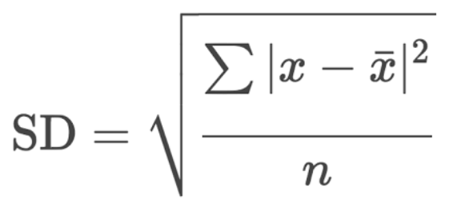 
 

 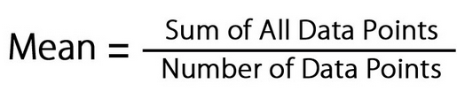 
 

   Additionally, it will be convenient in this step to compute and store the prior probability p(Ck) for each label. This can be done by keeping track of the number of times each label appears in the training data.
   

#### 2.	Implement the predict(observation) method:

   Given a new data point, prediction requires two steps: 
   1.	Compute the conditional probabilities for each feature/label combination. For a feature x and label C with mean μ and standard deviation σ (computed in training), the conditional probability can be computed using the formula here:

 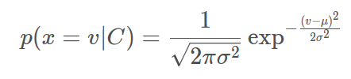 
 

      Here v is the value of feature x in the new data point.

  2.	Use the conditional probabilities in a Naive Bayes classifier. This can be done using the formula here:
 
 
 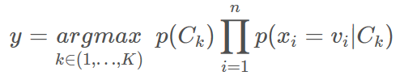 
 
 
   In this formula, the argmax is taken over all possible labels Ck and the product is taken over all features xi with values vi.
